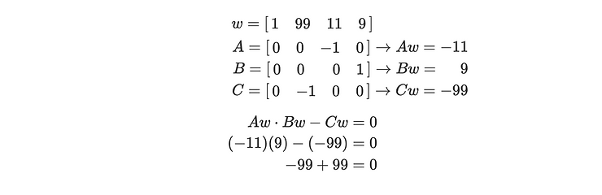

# R1CS (Rank 1 constraint system)

Converting the circuit into R1CS file :

```sh
circom multiply2.circom --r1cs --sym

->

template instances: 1
non-linear constraints: 1
linear constraints: 0
public inputs: 0
private inputs: 2
public outputs: 1
wires: 4
labels: 4
Written successfully: ./multiply2.r1cs
Written successfully: ./multiply2.sym
Everything went okay


# To print the generated output :
snarkjs r1cs print multiply2.r1cs

->

[INFO]  snarkJS: [ 21888242871839275222246405745257275088548364400416034343698204186575808495616main.x ] * [ main.y ] - [ 21888242871839275222246405745257275088548364400416034343698204186575808495616main.out ] = 0

```

Here are the differences in Circom’s implementation:

- Columns with zero value are not printed
- Circom writes Cw = AwBw as AwBw - Cw = 0

To solve the circuit using WASM solver

```sh
circom multiply2.circom --r1cs --wasm --sym

->

template instances: 1
non-linear constraints: 1
linear constraints: 0
public inputs: 0
private inputs: 2
public outputs: 1
wires: 4
labels: 4
Written successfully: ./multiply2.r1cs
Written successfully: ./multiply2.sym
Written successfully: ./multiply2_js/multiply2.wasm
Everything went okay
```

Creating input and generating the witness :

```sh
echo '{"x": "11", "y": "9"}' > input.json
node generate_witness.js multiply2.wasm input.json witness.wtns
snarkjs wtns export json witness.wtns witness.json
cat witness.json

->

[
 "1",
 "99",
 "11",
 "9"
]

```


